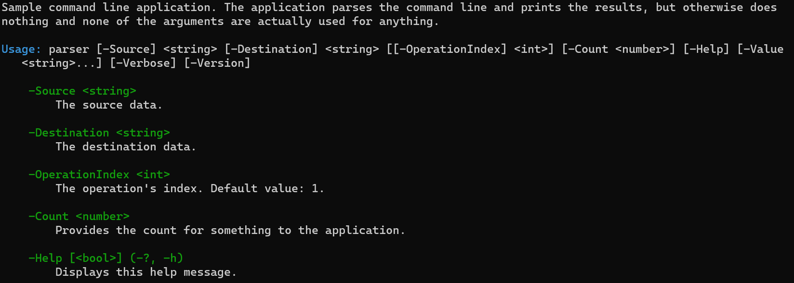

# Generating usage help

When you have an application that accepts command line arguments, you'll want to be able to show a
help message to the user, indicating all the possible command line arguments.

Creating this kind of usage help text is tedious, and you must make sure it is kept up to date
whenever you change the arguments to your application. Ookii.CommandLine generates this usage help
text automatically, alleviating this problem.

Usage help can be generated using the `command_line_parser::write_usage()` method. The output can be
customized using the `usage_writer` class. Various overloads of the `command_line_parser::parse()`
method that take a parameter of type `usage_writer` also automatically print usage help if an
error occurred while parsing.

By default, the `usage_writer` class will use an [`ookii::line_wrapping_ostream`](LineWrappingStream.md)
for the standard output, white-space wrapping the generated output at the console line width.

The following example shows the usage help generated for the [parser sample](../samples/parser)
included with the Ookii.CommandLine library:

```text
Sample command line application. The application parses the command line and prints the results, but
otherwise does nothing and none of the arguments are actually used for anything.

Usage: parser [-Source] <string> [-Destination] <string> [[-OperationIndex] <int>] [-Count <number>]
   [-Help] [-Value <string>...] [-Verbose] [-Version]

    -Source <string>
        The source data.

    -Destination <string>
        The destination data.

    -OperationIndex <int>
        The operation's index. Default value: 1.

    -Count <number>
        Provides the count for something to the application.

    -Help [<bool>] (-?, -h)
        Displays this help message.

    -Value <string>
        This is an example of a multi-value argument, which can be repeated multiple times to set
        more than one value.

    -Verbose [<bool>] (-v)
        Print verbose information; this is an example of a switch argument.

    -Version [<bool>]
        Displays version information.
```

The usage help consists of three components: the application description, the argument usage syntax,
and the argument descriptions.

## Application description

The first part of the usage help is a description of your application. This is a short description
that explains what your application does and how it can be used. It can be any text you like, though
it’s recommended to keep it short.

The description is specified by using the `parser_builder::description()` method, as in the
following example:

```c++
auto parser = ookii::parser_builder{argv[0]}
    .description("This is the application description that is included in the usage help.")
    .add_argument(/* ... */);
```

If the description is not specified, no description is included in the usage help.

If you are using [subcommands](Subcommands.md), this first line is the command description, which
is specified when calling the `command_manager::add_command` method.

## Argument usage syntax

The argument syntax shows the arguments and their types, telling the user in short how your
application can be invoked from the command line. The argument syntax typically starts with the name
of the application executable, and is followed by all the arguments, indicating their name and type.
The syntax shows which arguments are required or optional, positional, and whether they allow
multiple values.

The order of the arguments in the usage syntax is as follows:

1. The positional arguments, in their defined order.
2. Required positional arguments, in alphabetical order.
3. The remaining arguments, in alphabetical order.

The syntax for a single argument has the following default format:

1. For a required, non-positional argument:

    ```text
    -ArgumentName <ArgumentType>
    ```

2. For an optional, non-positional argument:

    ```text
    [-ArgumentName <ArgumentType>]
    ```

3. For a required, positional argument:

    ```text
    [-ArgumentName] <ArgumentType>
    ```

4. For an optional, positional argument:

    ```text
    [[-ArgumentName] <ArgumentType>]
    ```

5. For a switch argument:

    ```text
    [-ArgumentName]
    ```

6. For a multi-value argument (which can be combined with the other formatting options):

    ```text
    -ArgumentName <ArgumentType>...
    ```

Essentially, anything that's optional is enclosed in square brackets, switch arguments have their
value description (the argument type) omitted, and multi-value arguments are followed by an ellipsis.
The exact formatting can be customized using the `ookii::usage_writer` class.

If your application has a lot of arguments, the usage syntax may become very long, and therefore
hard to read. Set the `usage_writer::use_abbreviated_syntax` field to omit all but the positional
arguments; the user can instead use the argument description list to see what arguments are
available.

If you are using [long/short mode](Arguments.md#longshort-mode), you can set the
`usage_writer::use_short_names_for_syntax` property to use short arguments names instead of long
names, for arguments that have a short name, in the usage syntax.

### Value descriptions

Arguments are followed by a short description of the type of value they support, in angle brackets.
This is called the _value description_. It's a short, typically one-word description that describes
the kind of value the argument expects. It should _not_ be used for the longer description of the
argument's purpose.

The value description defaults to the type of the argument (e.g. `int` or `string`), stripping off
any namespace prefixes. For multi-value arguments or arguments using `std::optional<T>`, the name
of the underlying type is used.

To specify a different value description for a particular argument, use the
`parser_builder::argument_builder::value_description()` method:

```c++
int argument;
auto parser = ookii::parser_builder{argv[0]}
    .add_argument(argument, "Argument").value_description("number")
    .build();
```

This will cause the argument's syntax to show `-Argument <number>` instead of `-Argument <int>`.

You can also provide a custom default value description for a particular type by specializing
the `ookii::value_description` template:

```c++
template<>
struct ookii::value_description<int>
{
    static std::string get()
    {
        return "number";
    }
};
```

Now, all arguments of type `int` will use "number" as the value description.

Usually, you should provide a custom value description for any template type, because their type
name will not look very good. Ookii.CommandLine already provides a `value_description`
specialization for `std::basic_string`, so the value description looks like "string" and not like
"basic_string\<char, std::char_traits\<char>, std::allocator\<char> >"

Switch arguments don't have a value description in the argument syntax, though they do in the
argument description list.

## Argument descriptions

After the usage syntax, the usage help will write a list of all arguments with their detailed
descriptions.

An argument's description can be specified using the
`parser_builder::argument_builder::description()` method:

```c++
int arg;
auto parser = ookii::parser_builder{argv[0]}
    .add_argument(arg, "Arg").description("Provides a value to the application.")
    .build();
```

By default, the list of argument descriptions will include any argument aliases, and their default
values if set. This, along with the format of the descriptions, can be customized using the
`usage_writer` class.

You can choose which arguments are included in the description list using the
`usage_writer::argument_description_list_filter` field. By default, this is set to
`description_list_filter_mode::information`, which means that any argument that has any information
that isn't part of the usage syntax will be included. This could be a description, aliases, or a
default value. You can choose to include only arguments with descriptions (this was the default
behavior before version 2.0), all arguments, or to omit the description list entirely.

You can also choose the sort order of the description list using the
`usage_writer::argument_description_list_order` property. This defaults to the same order as the
usage syntax, but you can also choose to sort by ascending or descending long or short name.

Since the `parse()` method overloads that take a `usage_writer` will show usage help on error, if
you have a lot of arguments it may be necessary for the user to scroll up past the argument
description list to see the error message to determine what was wrong with the command line. Since
this may be inconvenient, you can choose to omit the argument description list, or the usage help
entirely, when an error occurs, using the `parser_builder::show_usage_on_error()` method. In this
case, the user will have to use the `-Help` argument to see the full help.

## Color output

When possible, Ookii.CommandLine will use color when writing usage help. This is controlled by the
`use_color` parameter of the `usage_writer` class constructor. When set to `std::nullopt` (the
default), the `usage_writer` tries to determine whether color is supported. Color will only be
enabled if:

1. There is no environment variable named `NO_COLOR`.
2. The standard output stream is not redirected.
3. The `TERM` environment variable is not set to `dumb`.
4. On Windows, enabling virtual terminal sequences using [`SetConsoleMode`][] must succeed.
5. On other platforms, the `TERM` environment variable must be defined.

The `usage_writer` class uses virtual terminal sequences to set color. Several components of the
help have preset colors, which can be customized using fields of the `usage_writer` class. Set them
to any of the constants in the `ookii::vt::text_format` namespace, or any other valid virtual
terminal sequence.

In order to support proper white-space wrapping for text that contains virtual terminal sequences,
the `line_wrapping_ostream` class will not count virtual terminal sequences as part of the line
length.

The below is an example of the usage help with the default colors.



## Customizing the usage help

The usage help can be heavily customized. We've already seen how it can be customized using things
such as custom value descriptions, or various fields of the `usage_writer` class. These can
also be used to control the indentation of the text, what elements to include, and various small
formatting changes such as whether to use white space or the custom name/value separator.

To customize the usage even further, you can derive a class from the `usage_writer` class. The
`usage_writer` class has protected virtual methods for every part of the usage. These range from
top-level methods like `write_parser_usage_core()` which drives the entire process, methods
responsible for a section such as `write_parser_usage_syntax()` or `write_argument_descriptions()`,
methods responsible for a single argument like `write_argument_syntax()` or
`write_argument_description()`, down to methods that write single piece of text like
`write_argument_name()` or `write_value_description()`.

> The `usage_writer` class has several fields and methods that apply only to
> [subcommands](Subcommands.md#subcommand-usage-help), so setting or overriding these will have no
> effect if you are not using subcommands.

These methods call each other, so you can customize as little or as much as you like, depending on
which methods you override. For example, if you want to use something other than angle brackets for
value descriptions, just override `write_value_description()` (and probably also
`write_value_description_for_description()`). Or, if you want to change the entire format of the
descriptions, override `write_argument_description()`.

To specify a custom usage writer, pass it to the `command_line_parser::parse()` method or the
`command_line_parser::write_usage()` method.

The [custom usage sample](../samples/custom_usage) uses a custom usage writer to radically alter the
format of the usage help, as seen below.

```text
DESCRIPTION:
  Sample command line application. The application parses the command line and prints the results,
  but otherwise does nothing and none of the arguments are actually used for anything.

USAGE:
  custom_usage [--source] <string> [--destination] <string> [[--operation-index] <int>] [arguments]

OPTIONS:
  -c|--count <number>        Provides the count for something to the application.
  -d|--destination <string>  The destination data.
  -?|-h|--help               Displays this help message.
  --operation-index <int>    The operation's index. [default: 1]
  -p|--process               Does the processing.
  -s|--source <string>       The source data.
  --value <string>           This is an example of a multi-value argument, which can be repeated
                             multiple times to set more than one value.
  -v|--verbose               Print verbose information; this is an example of a switch argument.
  --version                  Displays version information.
```

You can see that the `usage_writer` class offers a lot of flexibility to customize the usage help
to your liking.

## Subcommand usage help

Please see the [subcommand documentation](Subcommands.md) for information about their usage help.

And actually, [subcommands](Subcommands.md) are what we'll cover next.

[`SetConsoleMode`]: https://learn.microsoft.com/windows/console/setconsolemode
