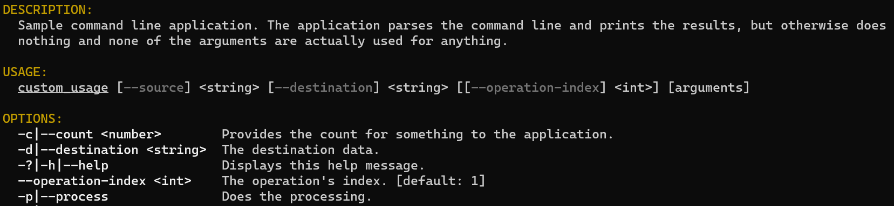

# Custom usage sample

This sample shows the flexibility of Ookii.CommandLine's usage help generation. It uses a custom
`usage_writer` to completely transform the way the usage help looks.

This sample uses the [code generation scripts](../../docs/Scripts.md), so to build this sample, you
must install [PowerShell 6 or later](https://github.com/PowerShell/PowerShell) for your platform
(including Windows; the built-in Windows PowerShell cannot be used).

After running the build, you can find the file `generated/custom_usage_generated.cpp` in the CMake
build output, if you want to see what the generated code looks like.

This sample also uses long/short parsing mode, but everything in it is applicable to default mode as
well.

It uses the same arguments as the [long/short mode sample](../long_short), so see that for more
details about each argument.

The usage help for this sample looks very different:

```text
DESCRIPTION:
  Sample command line application. The application parses the command line and prints the results,
  but otherwise does nothing and none of the arguments are actually used for anything.

USAGE:
  custom_usage [--source] <string> [--destination] <string> [[--operation-index] <int>] [arguments]

OPTIONS:
  -c|--count <number>        Provides the count for something to the application.
  -d|--destination <string>  The destination data.
  -?|-h|--help               Displays this help message.
  --operation-index <int>    The operation's index. [default: 1]
  -p|--process               Does the processing.
  -s|--source <string>       The source data.
  --value <string>           This is an example of a multi-value argument, which can be repeated
                             multiple times to set more than one value.
  -v|--verbose               Print verbose information; this is an example of a switch argument.
  --version                  Displays version information.
```

Customizing the usage help like this is not difficult, thanks to the `usage_writer` class. The
sample [derives a class from it](custom_usage_writer.h), and overrides several methods to customize
the format. This allows it to change the parts it wants, and reuse the code for the parts that are
not different.

The sample also customizes the colors of the output, as shown in the below screenshot:



If you compare this with the usage output of the [parser sample](../parser), which uses the default
output format, you can see just how much you can change by simply overriding some methods on the
`usage_writer` class.
