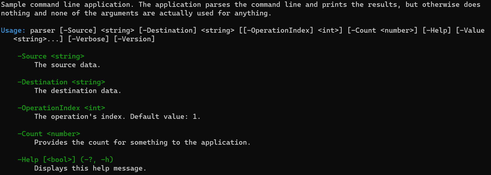

# Parser sample

This sample shows the basic functionality of Ookii.CommandLine for C++. It shows you how to define a
number of arguments with different types and options, and how to parse them. It then prints the
value of the supplied arguments (it does nothing else).

The sample contains detailed information about every step it takes, so it should be a good learning
resource to get started. Check [main.cpp](main.cpp) for details.

This sample prints the following usage help, when invoked with the `-Help` argument:

```text
Sample command line application. The application parses the command line and prints the results, but
otherwise does nothing and none of the arguments are actually used for anything.

Usage: parser [-Source] <string> [-Destination] <string> [[-OperationIndex] <int>] [-Count <number>]
   [-Help] [-Value <string>...] [-Verbose] [-Version]

    -Source <string>
        The source data.

    -Destination <string>
        The destination data.

    -OperationIndex <int>
        The operation's index. Default value: 1.

    -Count <number>
        Provides the count for something to the application.

    -Help [<bool>] (-?, -h)
        Displays this help message.

    -Value <string>
        This is an example of a multi-value argument, which can be repeated multiple times to set
        more than one value.

    -Verbose [<bool>] (-v)
        Print verbose information; this is an example of a switch argument.

    -Version [<bool>]
        Displays version information.
```

This is the default usage help format used by Ookii.CommandLine, with no modifications. It can be
customized using the `usage_writer` class.

You can see, for example, how the text is neatly white-space wrapped and indented, how the `-Count`
argument's custom value description is used, how the `-OperationIndex` argument shows the default
value, and how the aliases of the `-Verbose` and `-Help` arguments are shown.

If the console is capable, color output is used, as shown below (the colors are customizable).



If you run the sample without arguments, it instead shows this:

```text
The required argument 'Source' was not supplied.

Usage: parser [-Source] <string> [-Destination] <string> [[-OperationIndex] <int>] [-Count <number>]
   [-Help] [-Value <string>...] [-Verbose] [-Version]

Run 'parser -Help' for more information.
```

Here, it only shows the usage syntax and a message indicating how to get more help. This is because
the sample sets the `basic_parser_builder::show_usage_on_error()` option to
`usage_help_request::syntax_only`.

You can also use the automatic `-Version` argument:

```text
Ookii.CommandLine Sample 2.0
```
